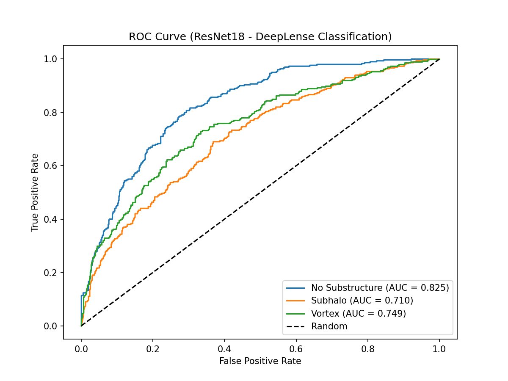

# DeepLense — Common Test I | GSoC 2026 | ML4Sci
## Multi-Class Gravitational Lens Classification

Classifying strong gravitational lensing images into three dark matter 
substructure categories using a fine-tuned ResNet18.

---

## Task

| Label | Class |
|-------|-------|
| 0 | No Substructure |
| 1 | Subhalo Substructure |
| 2 | Vortex Substructure |

---

## Approach

Fine-tuned **ResNet18** (ImageNet pretrained) with:
- Differential learning rates (backbone: 1e-4, head: 1e-3)
- Cosine annealing LR scheduler (T_max=50)
- Random horizontal/vertical flip augmentation
- Global mean subtraction + per-sample z-score normalisation
- Full dataset training (no per-class sample cap)

---

## Results

| Metric | Value |
|--------|-------|
| Best Val AUC (macro) | 0.9755 |
| Final Val AUC (macro) | 0.9715 |
| Val Accuracy | ~90% |

### Per-class AUC

| Class | AUC |
|-------|-----|
| No Substructure | 0.979 |
| Subhalo | 0.958 |
| Vortex | 0.977 |

### ROC Curve


The model achieves a macro AUC of 0.9755, reflecting strong discriminative ability
across all three substructure classes. Training on the full dataset was the key driver
of this improvement over earlier runs.

**No Substructure** is the easiest class to identify, achieving the highest AUC (0.979)
— the absence of substructure produces a cleaner, more symmetric lens profile that
ResNet18 picks up reliably. **Subhalo** remains the hardest class (AUC 0.958), as
subhalo perturbations are subtle and localised, making them visually similar to vortex
features. **Vortex** sits in between (AUC 0.977).

Differential learning rates and cosine annealing contributed to stable convergence —
the pretrained backbone was fine-tuned conservatively while the new classification
head trained more aggressively, preserving the rich ImageNet features while adapting
them to gravitational lensing.

---

## Weights

Pretrained model weights available via Google Drive:
- [best_lens_resnet.pth](https://drive.google.com/file/d/17OixSTVqs0pXqc2hbv_6wdQWWLImcoeL/view?usp=sharing) — Common Test I (ResNet18)

---

## Dataset

DeepLense dataset — not included due to size.  
Available via ML4Sci: https://ml4sci.org

---

## Dependencies
```
torch, torchvision, scikit-learn, numpy, matplotlib
```

---

## Author

**Prathik M Nambiar**  
B.Tech. Computer Science and Engineering, PES University, Bangalore  
GSoC 2026 — ML4Sci | Common Test I
